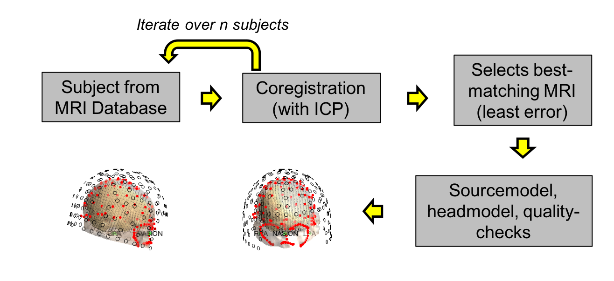
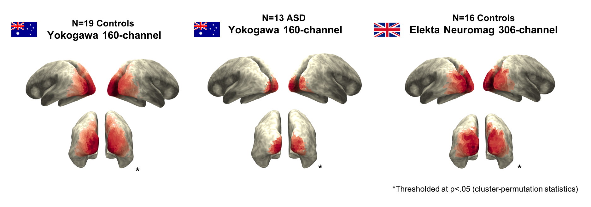
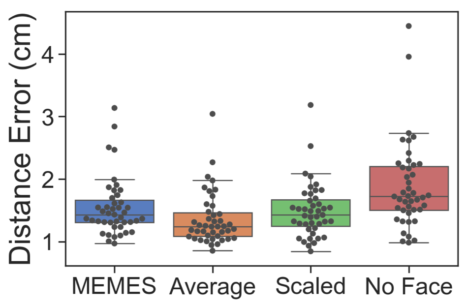
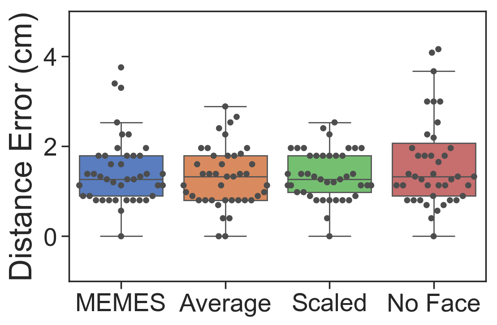
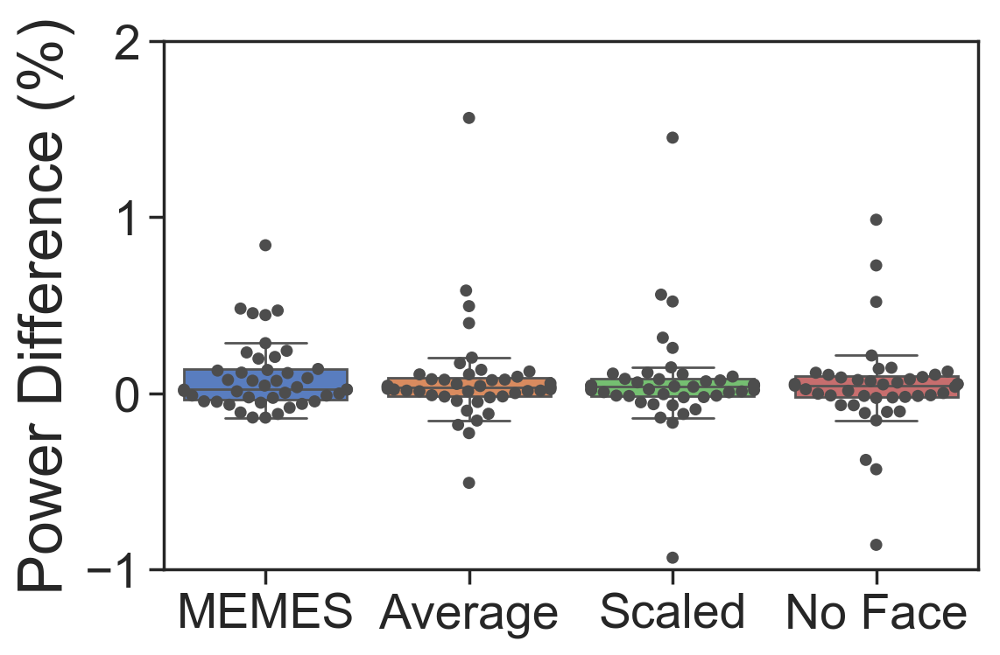

# MEMES
**MRI Estimation for MEG Sourcespace (MEMES)** is a set of tools for estimating an appropriate structural MRI for MEG source analysis in Fieldtrip and/or SPM.

If you use MEMES or any of the scripts in this repository, we ask you to please cite the DOI link below:

```MATLAB 
Robert Seymour. (2018, October 8). 
Macquarie-MEG-Research/MEMES: For Zenodo (Version v0.31). 
Zenodo. 
http://doi.org/10.5281/zenodo.1451031
```
[](https://zenodo.org/badge/latestdoi/117603642)

The scripts presented in this repository are customised for data acquired from the [Macquarie/KIT MEG laboratory](https://www.mq.edu.au/research/research-centres-groups-and-facilities/healthy-people/facilities/meg) using a 160-channel Yokogawa MEG system for adults and 125-channel Yokogawa MEG system for children. For Elekta data, please see /Elekta folder (please note this has not been fully tested).

### Outline

MEMES is based on the approach of [Gohel et al., (2017)](https://www.frontiersin.org/articles/10.3389/fninf.2017.00050/full). It uses an Iterative Closest Point (ICP) algorithm to match participant's headshape information to a database of template MRIs. The best matching MRI is chosen for subsequent source analysis.



MEMES produces a coregistered singleshell headmodel and 3D sourcemodel (warped to MNI space) for source analysis in Fieldtrip.

**Please note:** MEMES and ICP work best with some facial information alongisde the headshape information

### MRI Databases

Template MRIs can be obtained from:
- [Human Connectome Project (HCP)](https://db.humanconnectome.org) MEG data (95 participants)

- [Neurodevelopmental MRI Database](http://jerlab.psych.sc.edu/NeurodevelopmentalMRIDatabase/) with templates from 18 months - adult (copyright John Richards, USC)

Please refer to the [/create_library folder](./create_library) for more information regarding the organisation of MRI libraries.

### MEMES for participants aged 18+

For participants aged 18+, please use MEMES3.m in conjunction with an appropriate MRI database. You will need to create a series of meshes, headmodels and sourcemodels yourself. Alternatovely you can request a ready-made library from [@neurofractal](http://neurofractal.github.com). Please refer to the [/create_library folder](./create_library) for more information.

MEMES3 comes with various options including:
- *bad_coil:* include any bad marker coils (KIT-Macquarie specific)
- *method:* specifies the method for creating sourcemodels and headmodels ('best' fit; or 'average' over first 20 best-fitting MRIs). Testing is still ongoing, so use 'best' for now
- *scaling:* I have introduced a variable scaling parameter for the MRIs to help with subjects with exceptionally large or small heads (!).
- *sourcemodel_size:* size of sourcemodel grid (5,8 or 10mm)
- *include_face:* include or exclude facial information from polhemus data ('yes','no'). We advise 'yes' unless your MRI library has been defaced
- sens_coreg_method: to specific the algorithm for sensor realignment ('rot3dfit' or 'icp')


### Child MEMES (for participants aged <18)

Use child_MEMES/child_MEMES.m in conjunction with a database of meshes, headmodels and sourcemodels from the [Neurodevelopmental MRI Database](http://jerlab.psych.sc.edu/NeurodevelopmentalMRIDatabase/)

The results seem promising, with successful localisation of auditory tones to bilateral primary auditory cortex in a 5yo participant.


### How Well Does MEMES work?

Good question! 


Robert [(@neurofractal)](https://github.com/neurofractal) has done some investigation into this.

#### Validation #1: Does MEMES produce sensible results?

We analysed 3 datasets in which participants viewed a static visual grating vs baseline. This produces an increase in gamma (40-80Hz) power. Using MEMES followed by a beamformer, the visual gamma response was localised across these 3 datasets. Results show a very clear occipital increase in power, characteristic of the visual gamma response. 



So answer = YES!

#### Validation #2: How well does MEMES perform vs True MRIs?

For this visual gamma data, real subject specific MRIs were also acquired. These source results are treated as the 'ground truth'.

Various options were applied to MEMES computation including:

- Standard MEMES (no special options)
- Averaging the sourcemodel/headmodel over the best 20 MRIs, rather than taking the best fitting (found to improve the results in Gohel et al., 2017)
- Scaling the MRI sourcemodels up/down by 1-2% to find the best size for each member of the MRI database
- Excluding the facial information

Comparing the distance between sourcemodels created from the real and psedo MRI shows that for most options the errors are only 1-2cm. The 'No Face' condition seems to produce a few more errors than the other options.



Comparing the distance between the peak visual gamma response of the real and psedo MRI shows that for most options the errors are only 1-2cm.




Comparing the difference in visual gamma power between the real and psedo MRI shows that for all options, there were very changes.




