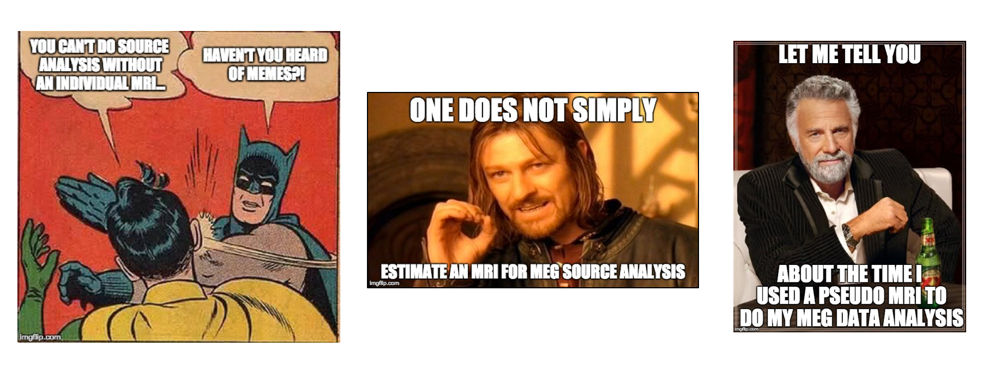
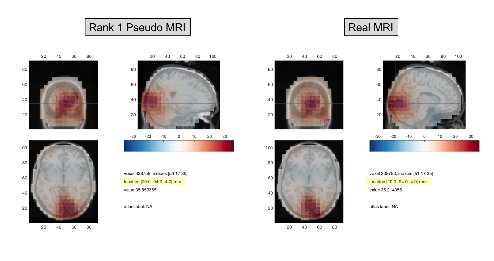
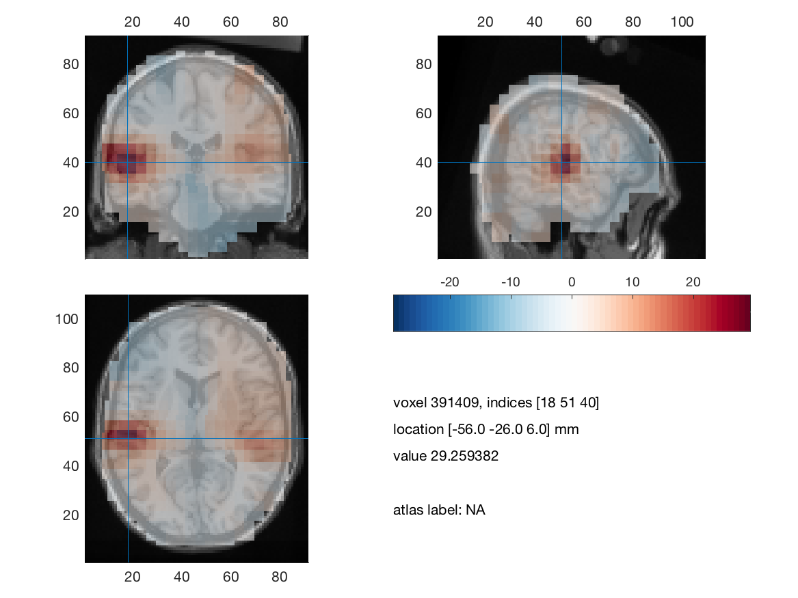

# MEMES
**MRI Estimation for MEG Sourcespace (MEMES)** is a set of tools for estimating an appropriate structural MRI for MEG source analysis in Fieldtrip and/or SPM.

These set of scripts are customised for data acquired from the [Macquarie/KIT MEG laboratory](https://www.mq.edu.au/research/research-centres-groups-and-facilities/healthy-people/facilities/meg) using a 160-channel Yokogawa MEG system for adults and 125-channel Yokogawa MEG system for children.

### Outline

MEMES is based on the approach of [Gohel et al., (2017)](https://www.frontiersin.org/articles/10.3389/fninf.2017.00050/full). It uses an Iterative Closest Point (ICP) algorithm to match participant's headshape information to a database of template MRIs. The best matching MRI is chosen for subsequent source analysis.

Template MRIs can be obtained from:
- [Human Connectome Project (HCP)](https://db.humanconnectome.org) MEG data (95 participants)

- [Neurodevelopmental MRI Database](http://jerlab.psych.sc.edu/NeurodevelopmentalMRIDatabase/) with templates from 18 months - adult (copyright John Richards, USC)

The code selects the most appropriate MRI to estimate a singleshell headmodel and 3D source-model warped to MNI space from this for subsequent source analysis.

**Please note:** MEMES and ICP in general work best with some facial information alongisde the headshape information

### Adult MEMES

Use MEMES3.m in conjunction with a database of meshes, headmodels and sourcemodels from the [Human Connectome Project (HCP)](https://db.humanconnectome.org) (MEG data).

The results seem promising, with only very minor differences to the patterns/peaks of source localistion compared to real anatomical MRIs

### Child MEMES

Use child_MEMES/child_MEMES.m in conjunction with a database of meshes, headmodels and sourcemodels from the [Neurodevelopmental MRI Database](http://jerlab.psych.sc.edu/NeurodevelopmentalMRIDatabase/)

The results seem promising, with successful localisation of auditory tones to bilateral primary auditory cortex in a 5yo participant.

### Things to work on:

- Validate with larger dataset
- Ground truth?
- Average over first 10 (or so) best fitting MRIs?
