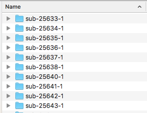
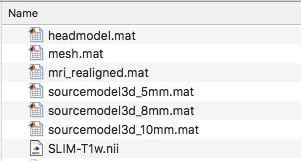

# Create an MRI library for MEMES
**MRI Estimation for MEG Sourcespace (MEMES)** is a set of tools for estimating an appropriate structural MRI for MEG source analysis in Fieldtrip and/or SPM. 

Please follow these instructions to create a compatible MRI database for MEMES. You will need the Fieldtrip toolbox in your MATLAB path.  

### Database Organisation

Each MRI database should be organised as below, with each subject in separately named folder, **no spaces**. It would probably help to have some sort of consistent naming practice, but MEMES doesn't really care too much. 

Try to keep your MRI database folder **tidy** - no stray files or folders!

Each subject folder should contain the following:

_(the SLIM-T1w.nii is the original MRI for this subject)_

### Initial Realign

In order to improve the accuracy of MEMES it is important to realign by marking the Nasion, LPA and RPA. 

### Mesh Creation

The realigned MRI can now be used to create a 3D cortical mesh of the subject's scalp. This is then matched with Polhemus data by MEMES. Steps are below:

	%% Segment the MRI leaving the scalp
	cfg = [];
    cfg.output    = 'scalp';
    cfg.scalpsmooth = 5;
    cfg.scalpthreshold = 0.08;
    scalp  = ft_volumesegment(cfg, mri_realigned);
        
    %% Create mesh out of scalp surface
    cfg = [];
    cfg.method = 'isosurface';
    cfg.numvertices = 10000;
    mesh = ft_prepare_mesh(cfg,scalp);
    mesh = ft_convert_units(mesh,'mm');

**Note 1:** You may need to alter the *cfg.scalpthreshold = 0.08* parameter for some subjects. Always plot this for quality checking and adjust the threshold as needed.

**Note 2:** You can make the mesh more or less dense by altering the *cfg.numvertices = 10000* parameter. However 10,000 seems to work well for MEMES as a balance between and accuracy computational efficiency.

### Headmodel and Sourcemodel

The realigned MRI can now be used to create a singleshell headmodel: 

	%% Segment the brain
    cfg           = [];
    cfg.output    = 'brain';
    mri_segmented  = ft_volumesegment(cfg, mri_realigned);
        
    %% Create singleshell headmodel
    cfg = [];
    cfg.tissue = 'brain';
    cfg.method='singleshell';
    headmodel = ft_prepare_headmodel(cfg, mri_segmented);
	
	% Save headmodel
    save headmodel headmodel;

5,8 and 10mm sourcemodels aligned to MNI space also need to be crea: 

	%% Create sourcemodel
        
    sourcemodel_mm = [10 8 5];
        
    for size = 1:length(sourcemodel_mm);
            
        fprintf('Creating %dmm sourcemodel\n');
            
        % create the subject specific grid, using the template grid that has just been created
        cfg                = [];
        cfg.grid.warpmni   = 'yes';
        cfg.grid.resolution = sourcemodel_mm(size);
        cfg.grid.nonlinear = 'yes'; % use non-linear normalization
        cfg.mri            = mri_realigned;
        cfg.grid.unit      ='mm';
        cfg.inwardshift = '-1.5';
        grid               = ft_prepare_sourcemodel(cfg);
            
        % Save
        sourcemodel3d = grid;
        save(sprintf('sourcemodel3d_%dmm',sourcemodel_mm(size)),'sourcemodel3d');
            
        % Clear for next loop
        clear grid sourcemodel3d
    end
        
